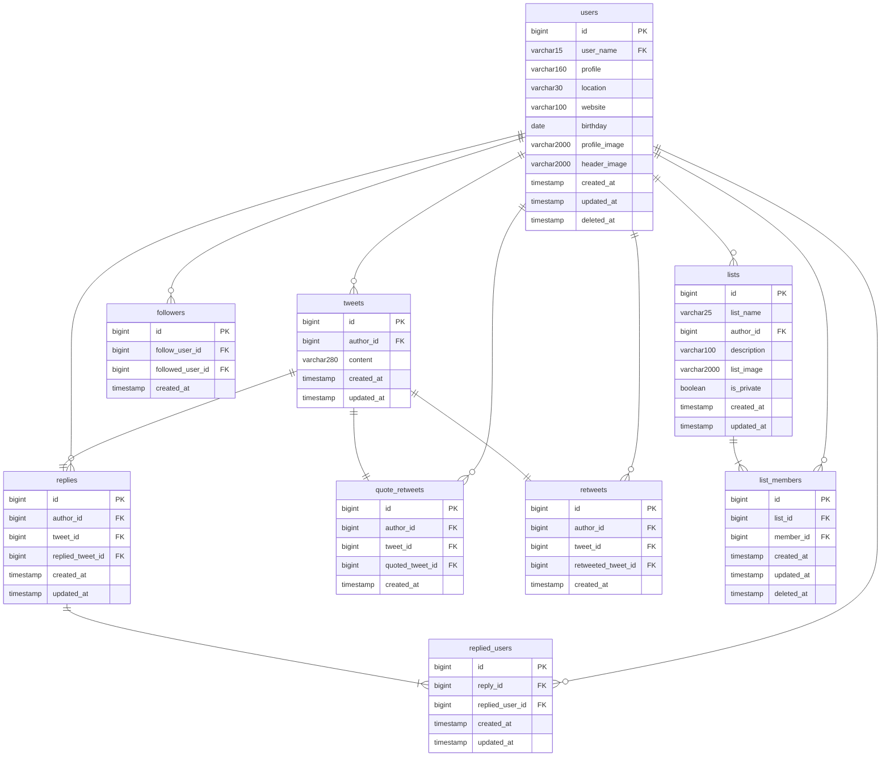

```mermaid
erDiagram
	users ||--o{ tweets : ""
	users ||--o{ replies : ""
	users ||--o{ quote_retweets : ""
	users ||--o{ retweets : ""
	users ||--o{ replied_users : ""
	users ||--o{ followers : ""
	users ||--o{ lists : ""
	users ||--o{ list_members : ""
	tweets ||--|| replies : ""
	tweets ||--|| quote_retweets : ""
	tweets ||--|| retweets : ""
	replies ||--|{ replied_users : ""
	lists ||--|{ list_members : ""

	users {
	  bigint id PK
	  varchar15 user_name FK
	  varchar160 profile
	  varchar30 location
	  varchar100 website
	  date birthday
	  varchar2000 profile_image
	  varchar2000 header_image
	  timestamp created_at
	  timestamp updated_at
	  timestamp deleted_at
	}
	tweets {
	  bigint id PK
	  bigint author_id FK
	  varchar280 content
	  timestamp created_at
	  timestamp updated_at
	}
	replies {
	  bigint id PK
	  bigint author_id FK
	  bigint tweet_id FK
	  bigint replied_tweet_id FK
	  timestamp created_at
	  timestamp updated_at
	}
	replied_users {
	  bigint id PK
	  bigint reply_id FK
	  bigint replied_user_id FK
	  timestamp created_at
	  timestamp updated_at
	}
	quote_retweets {
	  bigint id PK
	  bigint author_id FK
	  bigint tweet_id FK
	  bigint quoted_tweet_id FK
	  timestamp created_at
	}
	retweets {
	  bigint id PK
	  bigint author_id FK
	  bigint tweet_id FK
	  bigint retweeted_tweet_id FK
	  timestamp created_at
	}
	followers {
	  bigint id PK
	  bigint follow_user_id FK
	  bigint followed_user_id FK
	  timestamp created_at
	}
	lists {
	  bigint id PK
	  varchar25 list_name
	  bigint author_id FK
	  varchar100 description
	  varchar2000 list_image
	  boolean is_private
	  timestamp created_at
	  timestamp updated_at
	}
	list_members {
	  bigint id PK
	  bigint list_id FK
	  bigint member_id FK
	  timestamp created_at
	  timestamp updated_at
	  timestamp deleted_at
	}
```
